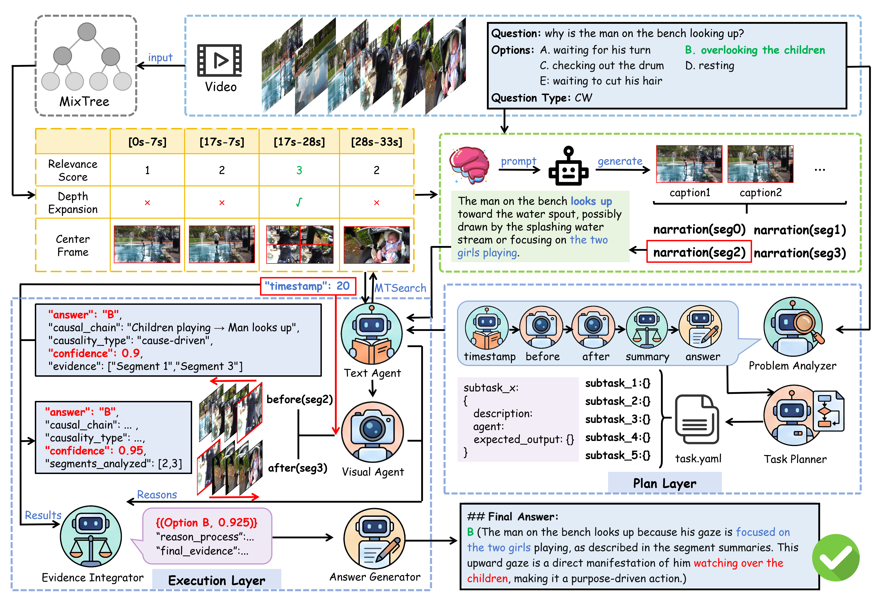
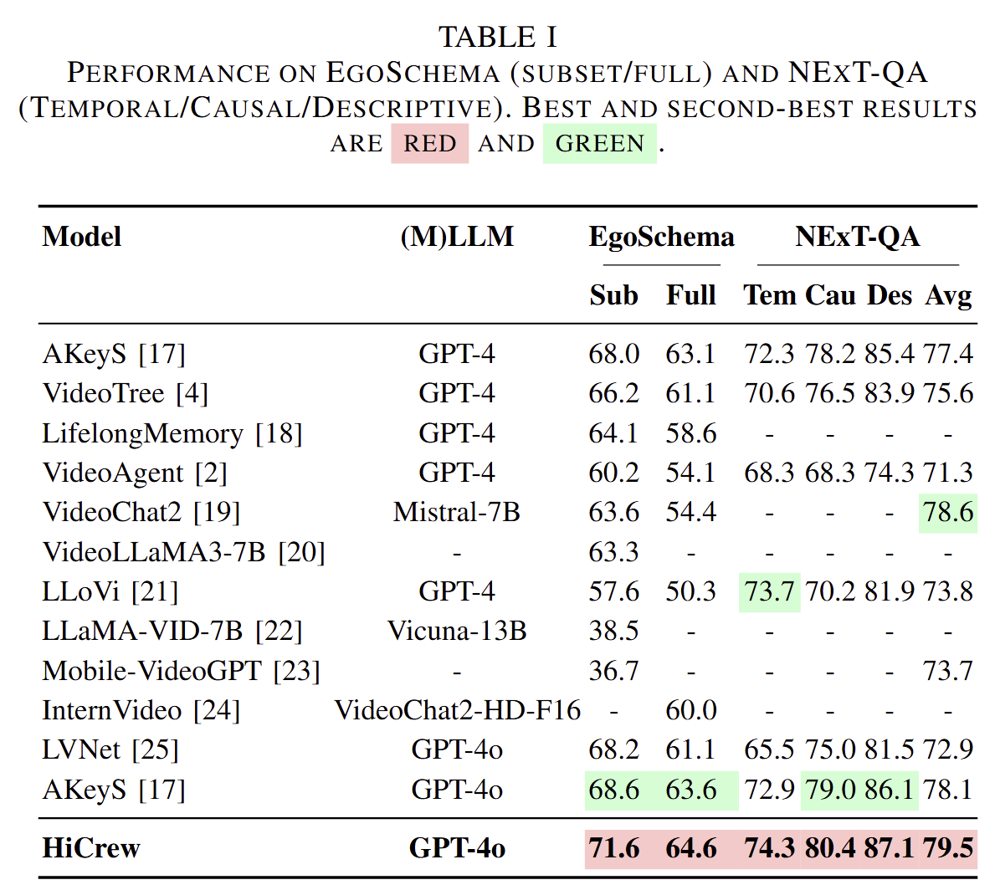

# HiCrew

<p align="center">
  <b>This work has been accepted by ICME 2026! 🎉</b><br>
</p>

## Overview / Method

The following image illustrates the case study and overall method of our approach:




## Performance

Here are our experimental results compared with other models:




## Installation

To set up the environment, you need to install `crewai` and its related components:

```bash
pip install crewai
# TODO: Teammates will add other dependencies here later
```

